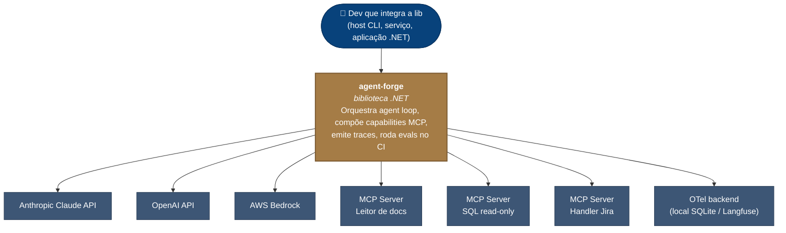
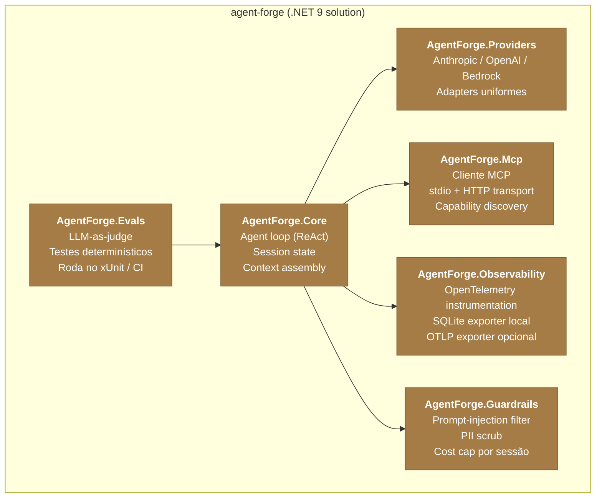
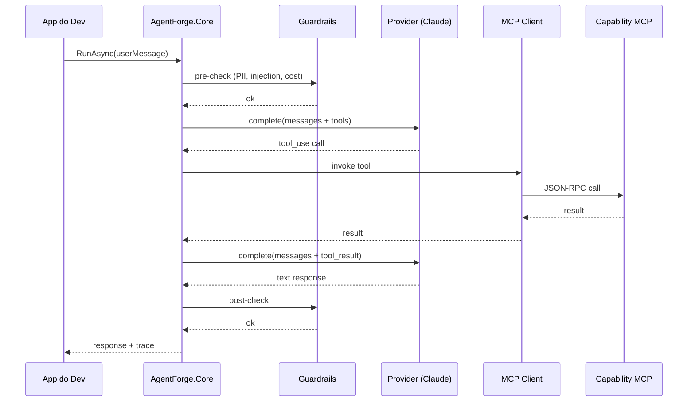

# Arquitetura — agent-forge

Diagramas C4 (nível 1 e 2) e fronteiras do sistema.

## Nível 1 — Contexto

`agent-forge` é uma **biblioteca .NET** consumida por aplicações que precisam orquestrar agentes LLM com capabilities compostas via MCP.

**Fronteiras**

- **Dentro do escopo:** agent loop, integração com providers de modelo, cliente MCP (stdio + HTTP), instrumentação OTel, suite de evals executável no CI, guardrails leves.
- **Fora do escopo:** hosting/serverless, UI/dashboard próprio, sistema de treinamento ou fine-tuning, RAG como cerne (RAG entra como capability MCP externa, não como módulo interno).

---

## Nível 2 — Contêineres (módulos internos)

Como `agent-forge` é biblioteca, "contêineres" aqui são **módulos internos** organizados por responsabilidade. Cada um é um projeto separado na solution.

**Contratos entre módulos**

- `Core` depende de abstrações (`IChatProvider`, `IMcpClient`, `ITracer`, `IGuardrail`) — nunca de implementações concretas. Isso permite swap de provider e teste unitário sem rede.
- `Providers` implementam `IChatProvider` — um por vendor (Anthropic, OpenAI, Bedrock).
- `Mcp` implementa `IMcpClient` — abstrai transport (stdio/HTTP) e serialização JSON-RPC.
- `Observability` implementa `ITracer` — thin wrapper sobre `System.Diagnostics.ActivitySource` compatível com OTel.
- `Guardrails` são plugáveis (`IGuardrail`) e rodam na ordem: PII scrub → prompt-injection filter → cost cap. Falha em qualquer um interrompe o turno.
- `Evals` é uma biblioteca de testes reutilizável — testes ficam em `tests/*.Evals` e rodam no CI como qualquer xUnit.

---

## Fluxo de um turno

Quando o Dev chama `agent.RunAsync(userMessage)`:

Traces são emitidos em cada fronteira (`App→Core`, `Core→Prov`, `Core→Mcp→Cap`) via `ActivitySource`. Exportador OTel envia local (SQLite) ou remoto (Langfuse OTLP).

---

## Referências

- [ADR-001 — MCP em .NET: SDK oficial vs. custom](./adr/001-mcp-em-dotnet.md)
- [ADR-002 — Stack de evals](./adr/002-eval-stack.md)
- [ADR-003 — Tracing (a escrever)](./adr/003-tracing.md)
- Issue #1 — Design v0 (no GitHub Issues)
